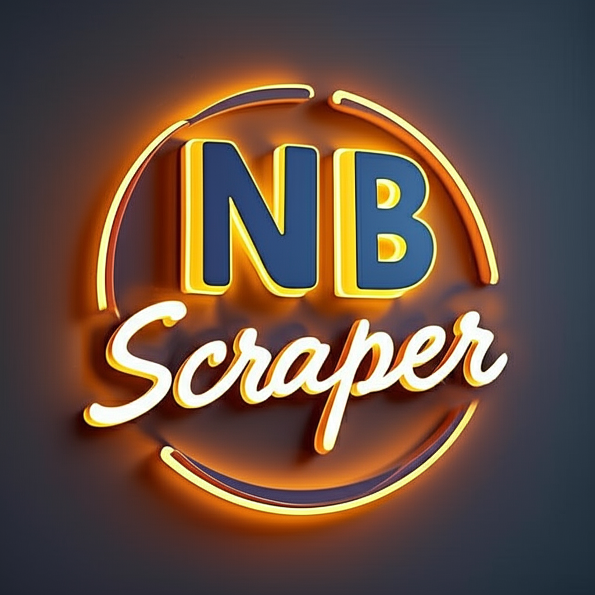

[](https://whatsapp.com/channel/0029Vb5EZCjIiRotHCI1213L)
[](https://npmjs.org/package/nb-scraper)
[](https://www.codefactor.io/repository/github/chakszzz/nb-scraper)
[](https://typescriptlang.org)
[](http://unlicense.org/)
[](https://app.codacy.com?utm_source=gh&utm_medium=referral&utm_content=&utm_campaign=Badge_grade)
[](https://github.com/Chakszzz/NB-Scraper/actions/workflows/ci.yml)

A comprehensive TypeScript scraper library by **NB Team** that provides easy-to-use functions for interact with various scraper service from NB Scripts.

### 📢 Join Our WhatsApp Channel
Untuk update terbaru, dukungan, dan sumber daya scraping terbaik, ikuti saluran resmi kami:

**NB SCRAPER** di WhatsApp:  
<a href="https://whatsapp.com/channel/0029Vb5EZCjIiRotHCI1213L">
  
</a> [Join Channel](https://whatsapp.com/channel/0029Vb5EZCjIiRotHCI1213L)

## Why NB-Scrape Library?

This project is designed to be easy to use. Visit the [WhatsApp Channel](https://whatsapp.com/channel/0029Vb5EZCjIiRotHCI1213L) for the code resources

## 📦 Installation
**Using npm:**
```bash
npm install nb-scraper
```
**Using yarn:**
```bash
yarn add nb-scraper
```
**Using pnpm:**
```bash
pnpm add nb-scraper
```

## Usage

### ESM (Modern JavaScript/TypeScript)

```typescript
import { generateDeepInfraResponse } from 'nb-scraper';

const result = await generateDeepInfraResponse({
  prompt: "Explain JavaScript in simple terms",
  model: "deepseek-ai/DeepSeek-R1"
});

if (result.status) {
  console.log(result.data.response);
}
```

### CommonJS (Node.js)

```javascript
const { generateDeepInfraResponse } = require('nb-scraper');

// Same usage as above
(async () => {
  const result = await generateDeepInfraResponse('What the meaning of Pahlawan Indonesia?');
  console.log(result);
})();
```
### See Documentation: [Nb-Scraper-Docs](https://nb-scraper.js.org)
### Success Response Example

```typescript
{
  creator: "...",
  status: true,
  data: {
    response: "...", 
  }
}
```

### Error Response Example

```typescript
{
  creator: "NB Team",
  status: false,
  error: "[NETWORK_ERROR] Request timeout after 30000ms"
}
```

## 🛡️ Error Handling

NB Scraper is designed to never throw errors. Instead, all functions return a response object with a `status` field:

```typescript
const result = await generateDeepInfraResponse('test query');

if (result.status) {
  // Success - use result.data
  console.log(result.data.response);
} else {
  // Error - check result.error
  console.error(result.error);
}
```

Common error types:
- `NETWORK_ERROR`: Connection, timeout, or server issues
- `INVALID_INPUT`: Invalid parameters or URL format
- `INVALID_RESPONSE`: Unexpected response format from API
- `RATE_LIMITED`: Rate limiting or quota exceeded
- `SERVICE_UNAVAILABLE`: Service temporarily unavailable

See the [ERROR TYPES](app/types.ts)

## Available Scrapers
**See The [scrapers folder](app/scrapers)**

## 📄 License

This project is licensed under the Unlicense – see the [LICENSE](LICENSE) file for details.

## 🔗 Links
- [npm Package](https://www.npmjs.com/package/nb-scraper)
- [NB-Scraper Channel](https://whatsapp.com/channel/0029Vb5EZCjIiRotHCI1213L)
- [Documentation](https://nb-scraper.js.org)
- [Issues](https://github.com/chakszzz/nb-scraper/issues)

Made with ☕